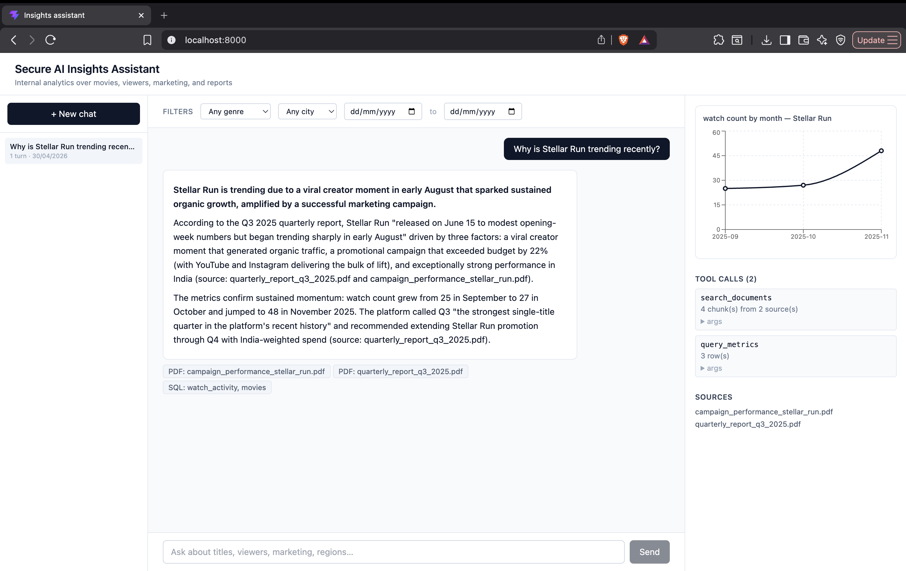
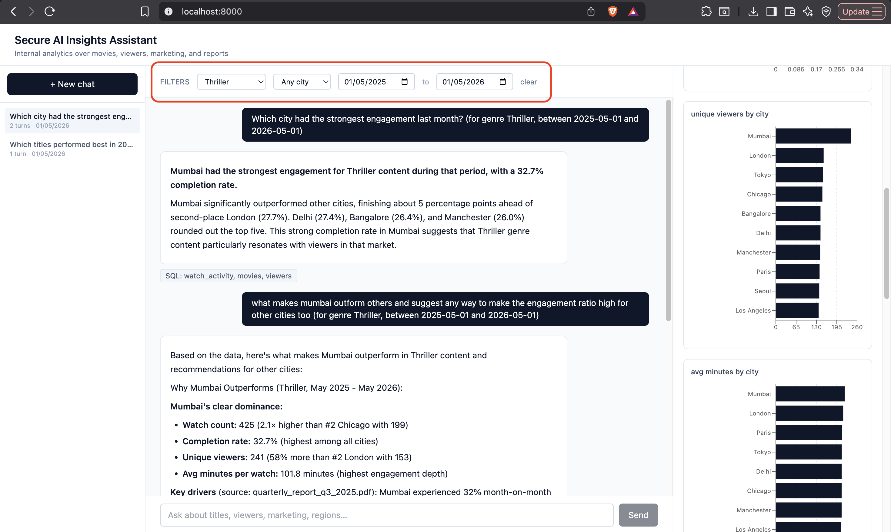
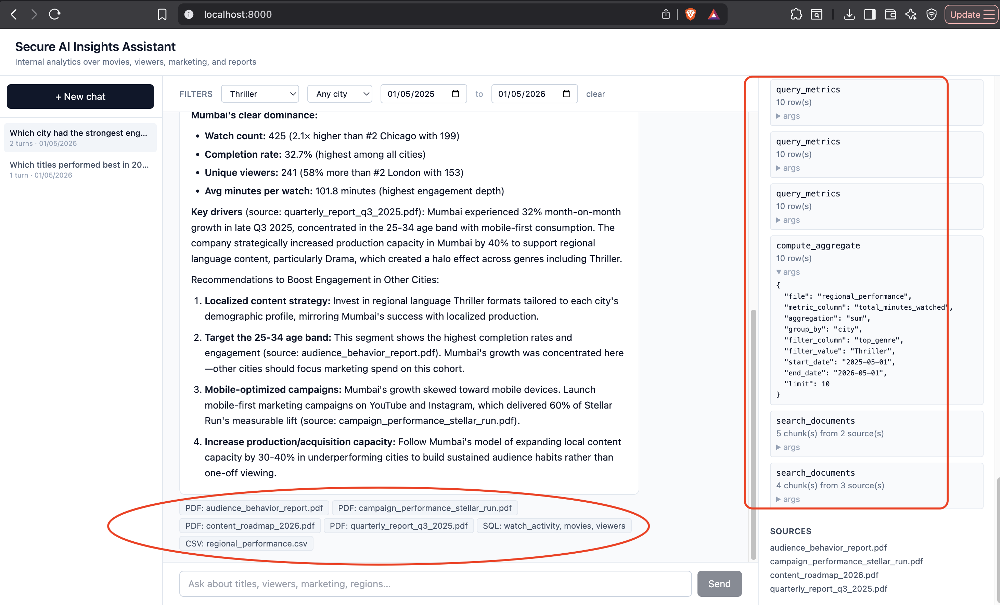
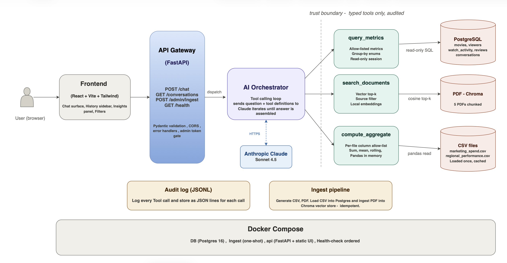
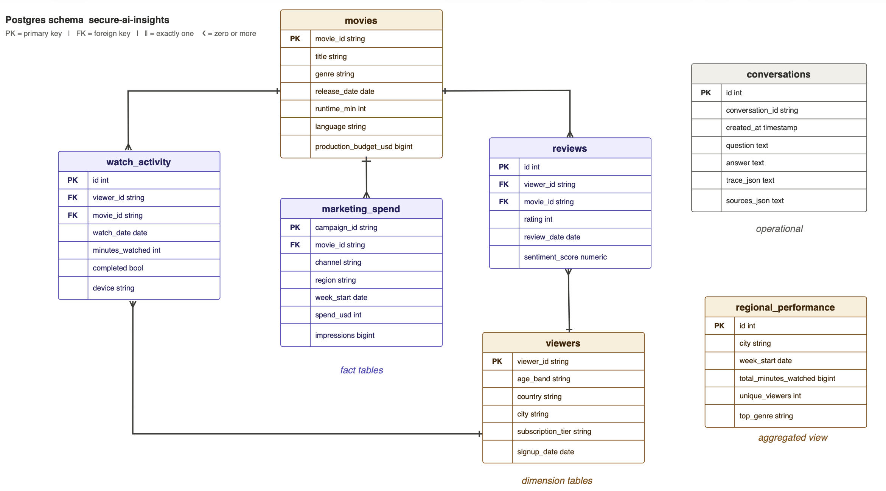
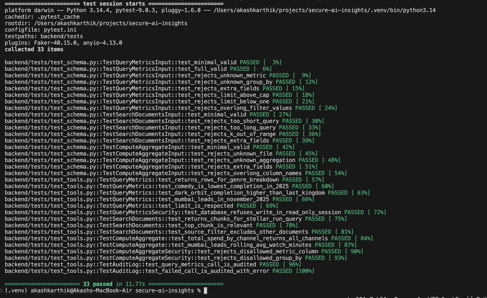
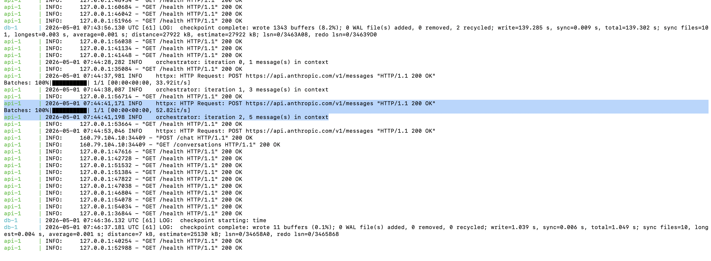

# Secure AI Insights Assistant

An AI-powered internal analytics assistant for a fictional entertainment company. Combines structured SQL data, unstructured PDF reports, and CSV analytics behind a tool-based access layer.



Interactive chat, Multi source answers, Charts included.

Marked red: Filtered condition Thriller from may 2025 to 2026, followed up by another question answer with chart representation



Marked red: Tool trace calls on the right, and answer source mentioned at the bottom




## Architecture Diagram



**Front-end (React Framework)**:\
• Chat assistant UI\
• Filters / selectors\
• Insights panel\
• Charts / visual summaries\
• Query history or tool trace

1. A user opens the React frontend in their browser and types a question. The frontend posts it to the **FastAPI gateway**, which validates the input, applies rate limits and the admin token gate where appropriate, and dispatches it to the AI orchestrator.
2. The orchestrator sends the question via `/chat` endpoint, along with definitions of the three available tools to **Anthropic Claude** over HTTPS, runs a tool calling loop, and returns the assembled answer back through the gateway.

3. dashed trust boundary is the gated tool layer.
Claude can only act on the data through three Python tools: 
- **query_metrics** for structured SQL against PostgreSQL
- **search_documents** for cosine top-k retrieval against the Chroma vector store (PDF)
- **compute_aggregate** for pandas analytics over the CSV files. 

4. Each tool has Pydantic enforced input validation, allow-listed columns and metrics, and runs against its data source under tight constraints: read-only sessions for the database, in-memory pandas for the CSVs, embedded query for the vector store.
**Claude never holds a database connection, never opens a file directly.**

5. **Data Ingestion**:
The ingest pipeline is a one-shot setup step that generates the synthetic data, loads 6 CSVs into Postgres, and builds the vector index from the 5 PDFs - it runs once when the stack first starts and is idempotent on re-runs.

6. **Logging**:
The audit log captures every tool call to a JSONL file, which the frontend's trace panel reads to show the user which tools fired with which arguments. 

7. The whole stack runs under **Docker Compose**, which orchestrates three services - the database, the one-shot ingest container, and the api container that serves both the FastAPI backend and the static React bundle on port 8000 - with health checks ensuring everything starts in the right order.

**Backend API / Services** for:
- Data ingestion              -  POST /admin/ingest
- Querying structured data    - query_metrics tool (reachable via /chat)
- Document retrieval          - search_documents tool (reachable via /chat)
- AI orchestration            - POST /chat
- Analytics generation        - delivered via the tools, accessed through POST /chat

**Postgres tables:**\



(Schema diagram & architecture diagram created and designed in draw.io platform)

movies - 99 titles, viewers - 5,000 viewers, watch_activity - ~51,000 rows, reviews - ~4,100 rows, marketing_spend - ~1,900 rows, regional_performance - ~1,100 rows.\
conversations               - one row per Q&A turn

**Chroma vector store** - one collection (documents), ~25–30 chunks from the five PDFs, embedded with all-MiniLM-L6-v2 (384-dim, cosine similarity).\
PDF Documents used: audience_behavior_report.pdf, campaign_performance_stellar_run.pdf, content_roadmap_2026.pdf, policy_guidelines.pdf, quarterly_report_q3_2025.pdf

Audit log - JSONL file at data/generated/audit.log. One line per tool call.

**CSV files** - marketing_spend.csv and regional_performance.csv. Read by compute_aggregate for pandas-style analytics.\
Operational CSVs - movies.csv, viewers.csv, watch_activity.csv, reviews.csv are read once during ingestion and loaded into Postgres tables.

## Security and data handling

- Read-only Postgres sessions for every tool call, enforced at the database level via `SET TRANSACTION READ ONLY` - even buggy code can't write.
- The LLM (Claude) never gets direct data access. It can only emit calls to three typed tools, each gated by Pydantic schemas with allow-listed enums for metrics, group-by dimensions, and CSV columns.
- All filter values are bound as parameters, never concatenated into SQL - no injection surface.
- Document embeddings and retrieval run locally. Viewer data never leaves the server for retrieval.
- Every tool call is recorded to an append-only audit log with arguments, success, and elapsed time.
- The admin re-ingestion endpoint is gated by a token (`X-Admin-Token`); chat and read endpoints are open within the deployment but rate-limited at the edge.
- Secrets (API keys, admin tokens, DB credentials) live in `.env`, which is gitignored. `.env.example` documents the required variables without leaking values.

## Validation and Error handling

**Validation** : Every input is gated by a Pydantic schema with extra="forbid".\
Categorical fields are enums (Metric, GroupBy, Aggregation, CsvFile, Stage) so only allow-listed values pass. strings have length bounds, numbers have range bounds.\
The CSV tool adds a second check - column names are validated against a per-file allow-list before reaching pandas.\
Validation failures return a structured 422.



**Error handling** : Three layers:
- Pydantic rejects bad input at the boundary.
- Inside the tool-calling loop, tool failures are caught and fed back to the LLM as tool-result errors so the model can recover.
- A global FastAPI exception handler - unhandled errors return a clean 500 with no stack trace leaked, and the real error is logged server-side.
The frontend renders error responses as red bubbles in the chat so failures stay visible.

## Repository structure
```
secure-ai-insights/
├── backend/
│   ├── app/
│   │   ├── main.py            FastAPI app, /chat, /conversations, /admin
│   │   ├── orchestrator.py    LLM tool-calling loop
│   │   ├── orchestrator_stub.py  response fallback for offline review (not used)
│   │   ├── registry.py        Tool registry; the LLM-to-Python bridge
│   │   ├── tools/             Three tool implementations
│   │   ├── schemas.py         Pydantic types shared across tools and API
│   │   ├── db.py              Read-only DB session
│   │   ├── audit.py           Append-only audit log
│   │   ├── history.py         Conversation persistence
│   │   └── admin_ingest.py    Admin-gated re-ingestion endpoint
│   ├── tests/                 Pytest validation + integration suite
│   └── requirements.txt
├── data/
│   ├── raw/                   Generated CSVs and PDFs (committed)
│   ├── generated/             Vector index, audit log (gitignored)
│   ├── generate.py            CSV generator
│   ├── generate_pdfs.py       PDF generator
│   ├── load_db.py             CSV - Postgres loader
│   └── ingest_pdfs.py         PDF - Chroma ingestion
├── frontend/                  React + Vite + Tailwind app
├── Dockerfile                 Multi-stage build (Node + Python + runtime)
├── docker-compose.yml         Three services: db, ingest, api
├── .dockerignore
├── .env                       Secrets (gitignored)
├── .env.example               Template to create .env file
├── .gitignore
└── README.md
```

## Deployment - Docker

- Docker Desktop is the only prerequisite needed.

The project is fully containerised. From a fresh clone, the entire stack - Postgres, the data pipeline, and the FastAPI app serving both the chat API and the React frontend - comes up with one command:

```bash
cp .env.example .env
# add the Anthropic API key to .env
docker compose up
```

The first 'up' might take some time as it builds the images, runs a one-shot ingest container that generates the data and populates Postgres and the vector store, then starts the API.\
Subsequent 'up' invocations skip the build and start in seconds. Once the api logs `Application startup complete`, the system is ready at `http://localhost:8000`.

Three services run under Compose: 
1. a Postgres container with persistent volumes for both the relational data and conversation history, 
2. a one-shot ingest container that handles all data generation and loading (gated by a Postgres health check so it never starts before the database is ready)
3. an API container that the api waits for via Compose's `service_completed_successfully` condition. 



The above terminal output displays the docker cli trace call, hitting POST request to Anthropic API through orchestrator for chat function with LLM.

Assumptions and Tradeoffs:
[Assumptions and tradeoff doc](Assumptions-Tradeoffs.md)